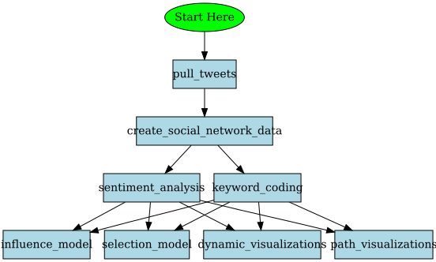

twitter-sna: tools for social network analysis with Twitter data
================
Nicole Jess, Yuqing Liu, Hasan Gokberk Bayhan, & Shimeng Dai

<!-- README.md is generated from README.Rmd. Please edit that file -->

This GitHub repository is intended to create social network datasets
based on data pulled from Twitter and provide some useful tools for
analysis.

## Obtain the Repository from GitHub

If you use Git (Torvalds et al., 2022) and have a GitHub account, either
clone or fork and clone the repository to your computer using the usual
Git commands (Bryan, 2018; Bryan et al., n.d., Chapter 16). We suggest
the method shown in [Section
16.2.2](https://happygitwithr.com/existing-github-first.html#rstudio-ide-1).

Otherwise, manually download a ZIP file from
<https://github.com/nrjess/twitter-sna> and unzip its contents to a
folder. Either way, the files should end up in a folder called
`twitter-sna` on your computer. That folder is your local copy of the
repository.

Note that the code uses relative rather than absolute folder path and
file name references. Moving or renaming subfolders and/or files may
cause problems. We have tested it only with the folder structure and
file naming used in the primary repository on GitHub.

## Understanding the Repository Structure and Contents

The structure for this repository is shown in the outline below, where
folder names and file names are `highlighted like this` and comments are
in normal text. The repository is set up as an [RStudio
project](https://support.rstudio.com/hc/en-us/articles/200526207-Using-RStudio-Projects).

- `twitter-sna`: This is the root folder for the repository.
  - [`data`](https://github.com/nrjess/twitter-sna/tree/main/data): This
    folder is where the data files produced by our scripts will be
    stored.
    - `Placeholder.text` This text file is just present to ensure that
      the `data` subfolder will be created when you clone the repository
      or extract files from ZIP file copy of the repository obtained
      from GitHub.
  - [`scripts`](https://github.com/nrjess/twitter-sna/tree/main/scripts):
    This folder is where you can find the key files you will need to use
    if you want to run these analyses on your own computer.
    - [`pull_tweets.RMD`](https://nrjess.github.io/twitter-sna/pull_tweets)
      This script creates a user-defined query, pulls data from Twitter,
      and saves the data to the user’s local repository.
    - [`create_social_network_data.RMD`](https://nrjess.github.io/twitter-sna/pull_tweets)
      This script restructures tweet data into a format that is useful
      for social network analysis (edgelists and nodelists).
    - `sentiment_analysis.RMD` This script codes tweets for sentiment.
      This example codes for positive and negative sentiments but tweets
      can be coded in many other ways.
    - `keyword_coding.RMD` This script codes tweets for keyword use. but
      tweets can be coded in many other ways.  
    - `dynamic_visualizations.RMD` This script creates a dynamic
      visualization that shows the changes in the network over time.
    - `path_visualizations.RMD` This script creates a visualizations of
      paths to explore the influence of individuals in a dynamic
      network.
    - `influence_model.RMD` This script runs an influence model.
    - `selection_model.RMD` This script runs a selection model.
  - `.gitignore`: This file tells Git what files to ignore and omit from
    synchronizing with the main repository on GitHub.
  - `LICENSE`: This file contains the terms of the license that applies
    to all source code in this repository.
  - `README.md`: This file is obtained by knitting the `README.Rmd` file
    and is used by GitHub to display information about the repository.
    In R Studio, you can read the formatted version by opening the file
    and clicking the Preview button.
  - `README.Rmd`: This file gives an introduction to the repository.
    Knitting it produces the `README.md` file and opens the preview
    automatically.
  - `twitter-sna.Rproj`: This is an RStudio project file. It contains
    some settings for working with the project in that software.

### Flow Diagram

This diagram shows the sequence that scripts should be run to ensure
that the required inputs have been created.



## Install R Packages from CRAN

Scripts in this repository depend on having a number of R packages
installed. Those packages are available from CRAN and can be installed
by running the following code in the R console.

``` r
install.packages(pkgs = c("tidyverse", "academictwitteR", "rtweet", "tidytags",
                          "textdata", "lubridate", "ergm", "networkD3", 
                          "linkcomm", "igraph", "here", "knitr", "rmarkdown", 
                          "bookdown"))
```

## Access to Twitter Data

To pull data from Twitter using the method in this repository, one must
have a Twitter developer account with a project that has Basic (or
higher) level access. To set up such a project, follow this link and set
up a project with the API access level that is appropriate for your
project: [Getting
Started](https://developer.twitter.com/en/docs/twitter-api/getting-started/about-twitter-api).

### Storing your Twitter access tokens

It is not safe to hard code your bearer token in your R script or have
your bearer token in your command history.

Running the code below opens the .Renviron file. Add a line in the file,
following the format: TWITTER_BEARER=YOURBEARERTOKENHERE, replacing
YOURBEARERTOKENHERE with your actual bearer token retrieved from the
[Twitter developer
portal](https://developer.twitter.com/en/portal/dashboard).

``` r
usethis::edit_r_environ()
```

Save the changes to .Renviron and close the file. Go to Session and
Restart R.

Now you will have a system environment variable in memory that contains
your bearer token. You can retrieve it as needed later using the
following command: Sys.getenv(“TWITTER_BEARER”). This should not be
printed

``` r
Sys.getenv("TWITTER_BEARER")
```

## Software Information

We use R Markdown to enhance reproducibility because it provides
excellent support for generating dynamic reports (Mair, 2016). Knitting
the source R Markdown script *README.Rmd* generates this Markdown file.
Knitting our other R Markdown scripts from this repository generates
HTML output files containing explanatory text, R code, plus R output
(both text and graphics).

## References

Bryan, J. (2018). Excuse me, do you have a moment to talk about version
control? *The American Statistician, 72*(1), 20-27.
<https://doi.org/10.1080/00031305.2017.1399928>

Bryan, J., The STAT 545 TAs, & Hester, J. (n.d.). *Happy Git and GitHub
for the useR*. <https://happygitwithr.com>

Mair, P. (2016). Thou shalt be reproducible! A technology perspective.
Frontiers in Psychology, 7(1079), 1-17.
<http://dx.doi.org/10.3389/fpsyg.2016.01079>

Torvalds, L., Hamano, J. C., & other contributors to the Git Project.
(2022). Git for Windows (Version 2.37.1) \[Computer program\]. Brooklyn,
NY: Software Freedom Conservancy. Retrieved from <https://git-scm.com>
